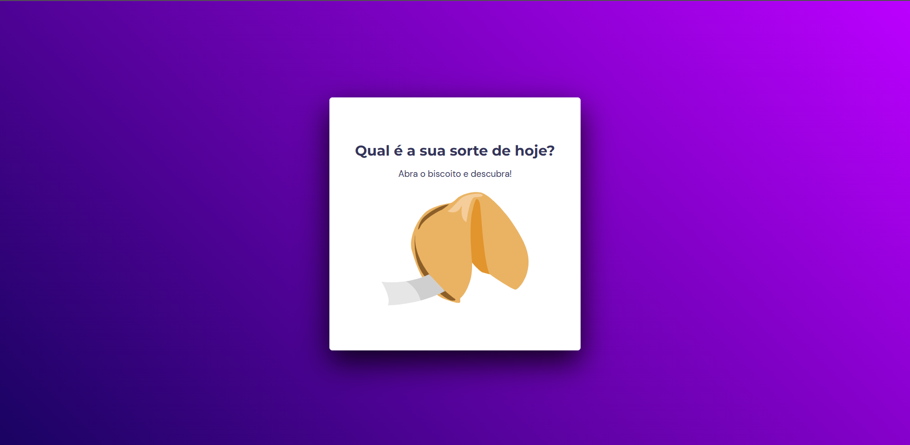

# Projeto Biscoito da Sorte | Trilha Explorer

---
## Tecnologias

  

---

## O que aprendi

- Saber o que é variável;
- Operadores matemáticos;
- Tipos de dados;
- Operadores comparativos;
- Arrays;
- Estruturas de repetição (for, for of, while);
- Função Math();
- Utilização do console no Browser (DevTools);
- Template strings/literals;
- Condicionais (if/else, switch);
- Object Literals;
- Funções;

---

## Contato

<a href = "mailto:probertos717@gmail.com">
